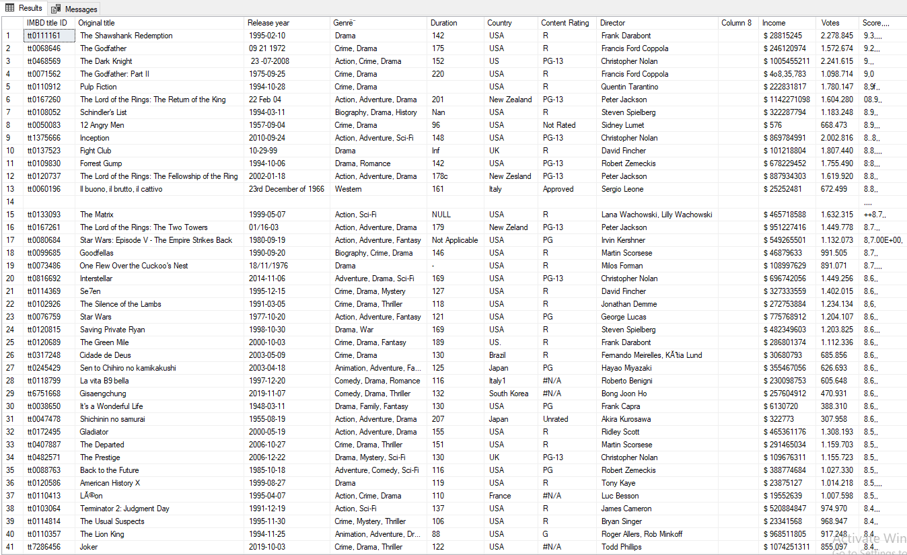

# Messy IMDB Dataset Cleaning Project  

This project focuses on cleaning and transforming a messy IMDB dataset downloaded from [Kaggle](https://www.kaggle.com/datasets/davidfuenteherraiz/messy-imdb-dataset). The goal was to turn raw data into a clean and usable format for further analysis.

## Key Steps Taken:  

1. **Handling Missing Values**  
   - Removed all `NULL` values and empty fields from the dataset.  

2. **Removing Duplicates**  
   - Identified and removed duplicate rows based on `titleID` and other relevant columns.  

3. **Cleaning Data Formats**  
   - Fixed extra spaces, special characters, and common errors in fields like `Release Year`, `Country`, `Income`, etc.  

4. **Standardizing Data Formats**  
   - Ensured consistency in date formats, genres, and years, using a uniform `DD-MM-YYYY` format.  

5. **Correcting Data Types**  
   - Converted columns like `Duration`, `Votes`, and `Income` to the appropriate data types (`INT`, `FLOAT`).  

6. **Removing Irrelevant Columns**  
   - Dropped the empty column `Column 8`, which served no purpose.
  

## Here is a little preview:

 
## Final Outcome:  
The dataset is now clean, consistent, and ready for more advanced analysis or visualization projects. 🎉  

For more details, check out the SQL script used for cleaning. 🚀
